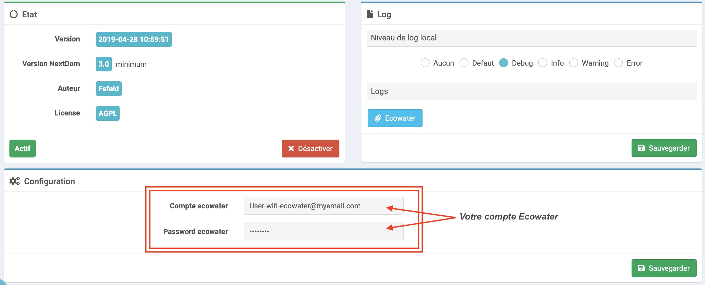
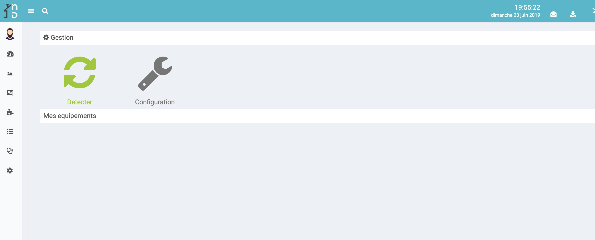
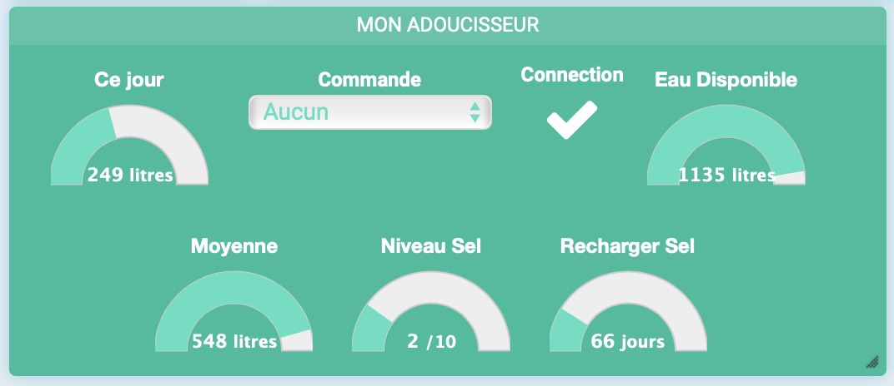
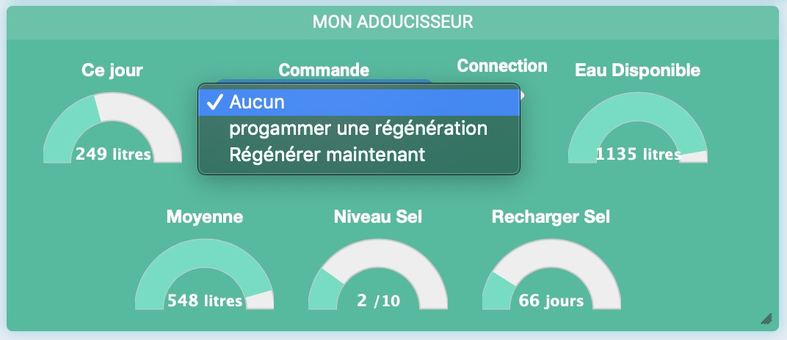

In a nutshell
===
This plugin controls your water softner (brand Ecowater).

Configuration
===
After downloaing this plugin, you will need to activate it and then provide your ecowater credentials (wifi.ecowater.com)

## Water softner configuration

You can access the the equipment configuration from the menu plugin->connected objects
To add an equipment, synchronize with you Ecowate Account (www.ecowater.com): click on [Detect]

here is the Equpment configuration :

* Name of equipment : Name of your water softner
* DSN  : "Device Serial Number" : unique ID of your water softner
* Model  : water softner model 
* Parent Object : Parent Objet
* Category  : Equipment category
* Activate : Active the equipment
* Visible : to make your equipment visible.

View
===
Your water softner :

* Today : Today's water usage
* Available : treated water available
* Average : average water usage
* Salt Level : Remaining Salt Level
* Recharge Salt : Number of days before recharging Salt.
* Connection : État de la connections internet (Adoucisseur <-> internet)

## Commandes 

* Command : (to translate)
          * « Programmer une régénération » :  programmer une régénération au prochain cycle (horaires définis sur wifi.ecowater.com)
          * « Régénérer maintenant » : lancer une régénération immédiate. (Pas d'annulation de commande possible)

Bug
===
En cas de bug avéré du plugin il est possible d'ouvrir une issue :

[https://github.com/NextDom/plugin-Ecowater/issues](https://github.com/NextDom/plugin-Ecowater/issues)
